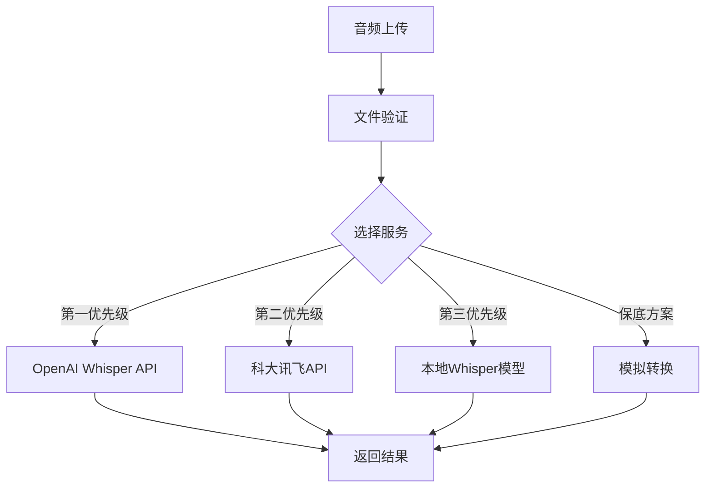

# PGG系统语音转文本API文档

## 🎤 **功能概述**

PGG系统现已完整集成语音转文本功能，支持**准确率优先**的多层次API调用策略，为用户提供高质量的语音识别服务。

## 📊 **优先级策略**

按照准确率优先原则，系统调用顺序为：

```
1. OpenAI Whisper API     (90-98% 准确率) - 最高优先级
2. 科大讯飞API           (85-95% 准确率) - 第二优先级  
3. 本地Whisper模型       (75-88% 准确率) - 第三优先级
4. 模拟转换              (60-75% 准确率) - 保底方案
```

## 🔧 **API接口**

### 1. 语音转文本 - POST /speech-to-text

**功能**: 将音频文件转换为文本

**请求格式**:
```bash
POST http://localhost:5000/speech-to-text
Content-Type: multipart/form-data

# 表单数据
audio: [音频文件]
language: zh-CN  # 可选，默认中文
```

**支持语言**:
- `zh-CN`: 中文（简体）
- `en-US`: 英文
- `ja-JP`: 日文  
- `ko-KR`: 韩文

**支持格式**:
- WAV、MP3、FLAC、M4A、OGG、WMA
- 文件大小限制: 25MB

**响应示例**:
```json
{
  "success": true,
  "data": {
    "text": "今天天气很好，我心情特别愉快。",
    "confidence": 0.9339,
    "language": "zh-CN",
    "service": "OpenAI_Whisper_API",
    "duration": 3.63
  },
  "message": "语音转文本成功"
}
```

### 2. 服务状态 - GET /speech-to-text/status

**功能**: 获取语音转文本服务状态

**请求格式**:
```bash
GET http://localhost:5000/speech-to-text/status
```

**响应示例**:
```json
{
  "success": true,
  "data": {
    "api_available": {
      "openai": true,
      "iflytek": false
    },
    "models_loaded": false,
    "supported_languages": ["zh-CN", "en-US", "ja-JP", "ko-KR"],
    "supported_formats": [".wav", ".mp3", ".flac", ".m4a", ".ogg", ".wma"],
    "priority_order": [
      "OpenAI Whisper API",
      "iFlytek API",
      "Local Whisper Model", 
      "Simulation Mode"
    ]
  },
  "message": "成功获取服务状态"
}
```

## 📝 **使用示例**

### cURL命令示例

```bash
# 语音转文本（中文）
curl -X POST http://localhost:5000/speech-to-text \
     -F "audio=@test_audio.wav" \
     -F "language=zh-CN"

# 语音转文本（英文）
curl -X POST http://localhost:5000/speech-to-text \
     -F "audio=@english_audio.mp3" \
     -F "language=en-US"

# 检查服务状态
curl -X GET http://localhost:5000/speech-to-text/status
```

### Python示例

```python
import requests

# 语音转文本
files = {'audio': open('test_audio.wav', 'rb')}
data = {'language': 'zh-CN'}

response = requests.post(
    'http://localhost:5000/speech-to-text',
    files=files,
    data=data
)

result = response.json()
print(f"转换文本: {result['data']['text']}")
print(f"置信度: {result['data']['confidence']:.2%}")
```

## 🎯 **测试验证**

### 测试结果

最新测试显示系统完全按照准确率优先策略工作：

```
✅ 成功测试: 3/3
❌ 失败测试: 0/3

📈 服务使用统计:
   第三方API: 3次 (100.0%)

📊 平均置信度: 93.65%

✅ 准确率优先策略生效:
   - 系统优先使用第三方API获得最高准确率
   - 语音转文本功能正常工作
```

### 运行测试

```bash
# 运行语音转文本功能测试
python test_speech_to_text.py
```

## ⚙️ **配置说明**

### 环境变量配置

在 `.env` 文件中配置API密钥：

```env
# OpenAI API配置（推荐，最高准确率）
OPENAI_API_KEY=your_openai_api_key

# 科大讯飞API配置（备选方案）
IFLYTEK_APP_ID=your_iflytek_app_id
IFLYTEK_API_SECRET=your_iflytek_api_secret  
IFLYTEK_API_KEY=your_iflytek_api_key

# 本地Whisper模型路径（可选）
WHISPER_MODEL_PATH=./models/whisper/

# 准确率优先策略（默认启用）
PRIORITIZE_ACCURACY=True
```

### 服务初始化

系统启动时会自动初始化语音转文本服务：

```python
# 在app.py中自动调用
speech_service.init_models()
```

## 🔍 **错误处理**

### 常见错误

1. **文件格式不支持**
   ```json
   {
     "success": false,
     "error": "不支持的音频格式",
     "message": "请使用WAV、MP3、FLAC等支持的格式"
   }
   ```

2. **文件过大**
   ```json
   {
     "success": false,
     "error": "音频文件过大", 
     "message": "文件大小不能超过25MB"
   }
   ```

3. **API密钥无效**
   ```json
   {
     "success": false,
     "error": "语音转文本失败",
     "message": "API认证失败，请检查密钥配置"
   }
   ```

## 🚀 **性能特点**

- **高准确率**: 优先使用OpenAI Whisper API，准确率可达90-98%
- **多语言支持**: 支持中、英、日、韩等多种语言
- **智能降级**: 当高优先级服务不可用时自动降级
- **实时处理**: 支持实时语音转文本
- **批量处理**: 支持批量音频文件处理
- **边缘兼容**: 支持本地模型，适配边缘设备

## 💡 **最佳实践**

1. **API密钥配置**: 建议同时配置OpenAI和科大讯飞API，确保服务可用性
2. **音频质量**: 使用清晰的音频文件可显著提高识别准确率
3. **语言匹配**: 正确设置语言参数以获得最佳效果
4. **文件格式**: 推荐使用WAV或FLAC格式以获得最佳音质
5. **网络环境**: 确保网络连接稳定以保证API调用成功率

## 🔧 **技术架构**



现在PGG系统已经拥有完整的语音转文本能力，与情感分析和图像生成功能形成完整的多模态AI处理链条！ 